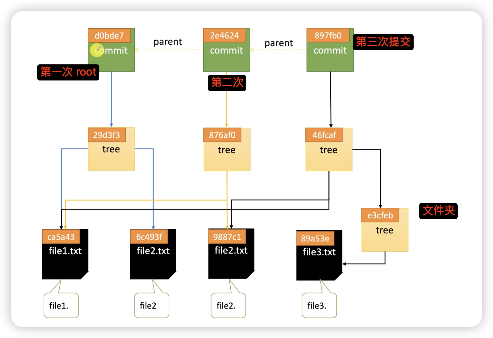

```
# 查看类型
$ git cat-file -t ce0136
blob
# 查看内容 # 不存储文件名
$ git cat-file -p ce0136
hello
# 查看大小
$ git cat-file -s ce0136
6

git ls-files -s

# 查看压缩包
git verify-pack -v .git/objects/pack/...idx

# 压缩
git gc
# 删除垃圾
git prune

# 查看远程分支和本地以为的远程分支差异
git branch -vv
```

## git add

- git add .会在.git/objects 下生成 hash
- 通过 SHA1 算法把 文件类型+文件长度+文件内容编码成 HASH 存储
- 提交后再次修改这个文件再次提交会生成新的 HASH
  - 原来的也会存在
- git ls-files 可以列出当前在索引区(暂存区)的文件
- git ls-files -s
  - 100644 文件权限
    - 100644 普通文件（可读写）
    - 100755 可执行文件
    - 120000 符号链接
    - 040000 目录（tree）
  - a9d34b8bda057872782fe9277cb7b2f1fd8f407d 文件 hash(blob 对象) 对应的就是 objects 下面的文件
  - 0 文件大小 ?
  - .gitignore 文件名

```
100644 a9d34b8bda057872782fe9277cb7b2f1fd8f407d 0       .gitignore
100644 9daeafb9864cf43055ae93beb0afd6c7d144bfa4 0       test.txt
```

## git commit

- 会生成一个类型为 commit 的 hash
- git cat-file -t 717e3

```
tree b16e803769c9cc02289f840b40ab6fe383f5db94
author xia <mtabe515@163.com> 1753258963 +0800
committer xia <mtabe515@163.com> 1753258963 +0800
```

- 内容 提交人信息 时间戳 时区
  - tree b16e8...对应着提交的文件
    - 如果是文件为 blob
    - 如果是文件夹为 tree

```
100644 blob a9d34b8bda057872782fe9277cb7b2f1fd8f407d    .gitignore
100644 blob 9daeafb9864cf43055ae93beb0afd6c7d144bfa4    test.txt
040000 tree c2574c019e5ce63693515eee02145af5b19894a1    views
```

- git cat-file -p c2574 对应着文件夹里面的文件

```
100644 blob 1a010b1c0f081b2e8901d55307a15c29ff30af0e    file.txt
```


## 文件状态

- untracked
- staged (git add)
- modified (已经 add 但是又修改了)
- Unmodified (git commit)

## reabse

## cheer-picker

## git tag

## 更新日志

## 构建
